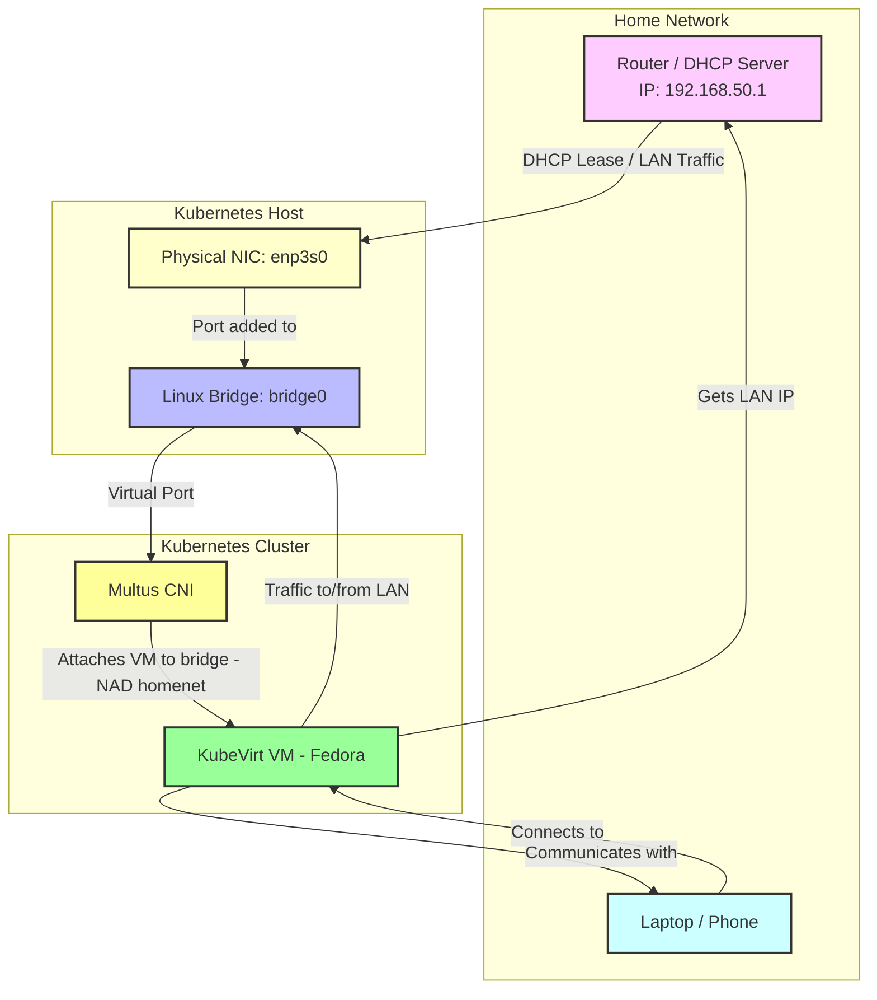
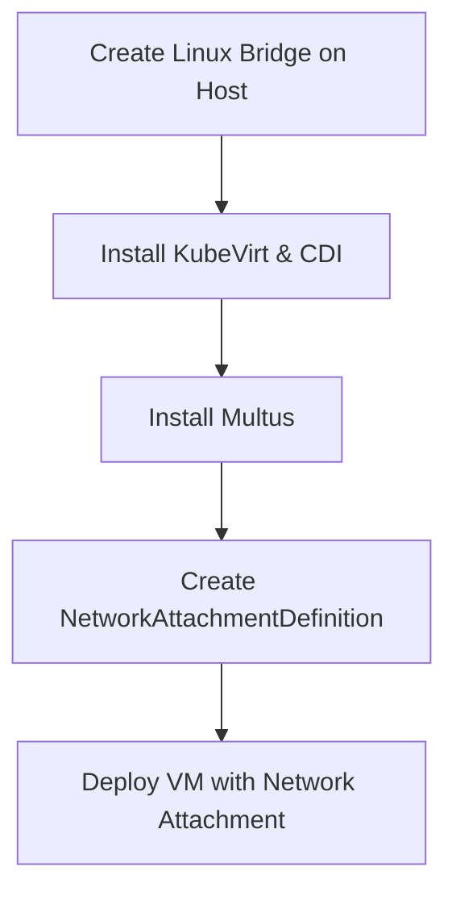
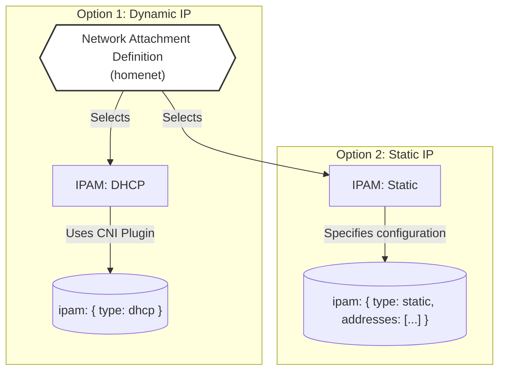

+++
date = '2025-08-23T17:33:52+10:00'
title = 'Setup Bridge Network for a Kubevirt VM'
series = ['kubevirt']
tags = ['kubernetes','multus','kubevirt','networking']
topics = ['homelab','vm-networking']
weight = 1
indexable = true
featured = true
draft = false
+++

## Introduction

Kubevirt VM connect to the cluster CNI (Flannel, Calico, etc), which is perfect for pod-to-pod communication but limits VMs that need full LAN access. We will address that by attaching it to the bridge network on host.

### Part of series on Kubevirt
1. [Create a (homeassistant VM) containerdisk]()
2. [Setup Bridge Network for a Kubevirt VM]()


---

## 1. Prerequisites
Before diving in, ensure you have:

- A K3s cluster with `kubectl` or `oc` access.
- Linux bridge configured on host (`bridge0`).
- `jq` installed (`sudo dnf install jq` or `brew install jq`).
- Basic knowledge of KubeVirt, CDI, and Kubernetes networking.

---
## HLD
1. **Home Network**  
   1.1 **Router (192.168.50.1):** Provides LAN IPs via DHCP.  
   1.2 **User Device:** Laptop/Phone accessing VM or cluster services.

2. **Kubernetes Host**  
   2.1 **Physical NIC (enp3s0):** Connects host to LAN.  
   2.2 **Linux Bridge (bridge0):** Virtual switch connecting VMs to LAN.  
   2.3 **Flow:** `NIC → Bridge → VM → LAN`

3. **Kubernetes Cluster**  
   3.1 **Multus CNI:** Manages VM network attachments.  
   3.2 **KubeVirt VM (Fedora):** Attaches to `bridge0` via `homenet` NAD.

4. **Network Flow**  
   4.1 VM gets LAN IP via DHCP.  
   4.2 `VM ↔ Linux Bridge ↔ Host NIC ↔ Router ↔ LAN`  
   4.3 VM can communicate directly with user devices.

5. **Key Points**  
   5.1 VM behaves like a normal LAN device.  
   5.2 LAN devices can access VM directly.  
   5.3 Multus + bridge allows bypassing pod network NAT.



---

## 2. Why use a Bridge Network for KubeVirt VMs
KubeVirt VMs normally connect to the cluster CNI (Flannel, Calico, etc), which is perfect for pod-to-pod communication but limits VMs that need:

- **LAN visibility** – VM gets an IP on the same subnet as your home devices.
- **Direct device access** – Talk to IoT devices, NAS, printers without NAT.
- **Predictable IPs** – DHCP or static assignment for consistent network identity.

**Solution:** Multus + bridge CNI. The VM attaches to `bridge0` on the host, making it a full LAN citizen.

---
### Process flow:

---

## 3. Host Linux Bridge Setup (`bridge0`) with NetworkManager
`bridge0` is a virtual switch; the physical interface (`enp3s0`) connects it to your LAN. VMs attach to `bridge0` via Multus.

### CLI Steps

```sh
# 3.1 Create the bridge
nmcli connection add type bridge con-name bridge0 ifname bridge0 stp no

# 3.2 Add physical NIC to bridge
nmcli connection add type ethernet con-name "Wired Connection" ifname enp3s0 master bridge0

# 3.3 Configure DHCP (or static if desired)
nmcli connection modify bridge0 ipv4.method auto
nmcli connection modify bridge0 ipv6.method auto

# 3.4 Enable autoconnect
nmcli connection modify bridge0 connection.autoconnect yes
nmcli connection modify "Wired Connection" connection.autoconnect yes

# 3.5 Bring up connections
nmcli connection up bridge0
nmcli connection up "Wired Connection"

# 3.6 Verify setup
nmcli connection show
nmcli device status
```

✅ **Result:** `bridge0` is live, VMs attached will get LAN IPs automatically.

💡 **Tip:** Use `nmcli` on headless servers for fully automated bridge setup.

---

## 4. Install KubeVirt
Deploy the operator and KubeVirt CR to run VMs on Kubernetes.

```sh
export KUBEVIRT_VERSION=$(curl -s https://api.github.com/repos/kubevirt/kubevirt/releases/latest | jq -r .tag_name)
echo $KUBEVIRT_VERSION
kubectl create -f https://github.com/kubevirt/kubevirt/releases/download/$KUBEVIRT_VERSION/kubevirt-operator.yaml
kubectl create -f https://github.com/kubevirt/kubevirt/releases/download/$KUBEVIRT_VERSION/kubevirt-cr.yaml
kubectl get pods -n kubevirt
```

<div style="background-color: #24d114ff; padding: 5px; border-left: 5px solid #12cb37ff; border-radius: 10px;">
⭐️ Tip: Wait until all pods in <code>kubevirt</code> namespace are <strong>Running</strong> before continuing.
</div>

---

## 5. Install Containerized Data Importer (CDI)
CDI handles VM image uploads and DataVolumes.

```sh
export CDI_VERSION=$(curl -s https://api.github.com/repos/kubevirt/containerized-data-importer/releases/latest | jq -r .tag_name)
echo $CDI_VERSION
kubectl create -f https://github.com/kubevirt/containerized-data-importer/releases/download/$CDI_VERSION/cdi-operator.yaml
kubectl create -f https://github.com/kubevirt/containerized-data-importer/releases/download/$CDI_VERSION/cdi-cr.yaml
kubectl get pods -n cdi
# kubectl -n cdi port-forward svc/cdi-uploadproxy 8443:443
```

---

## 6. Install Multus on K3s
Multus enables multiple interfaces per VM/pod—essential for bridge networking.

```sh
cat << EOF | oc apply -f-
apiVersion: helm.cattle.io/v1
kind: HelmChart
metadata:
  name: multus
  namespace: kube-system
spec:
  repo: https://rke2-charts.rancher.io
  chart: rke2-multus
  targetNamespace: kube-system
  valuesContent: |-
    config:
      fullnameOverride: multus
      cni_conf:
        confDir: /var/lib/rancher/k3s/agent/etc/cni/net.d
        binDir: /var/lib/rancher/k3s/data/cni/
        kubeconfig: /var/lib/rancher/k3s/agent/etc/cni/net.d/multus.d/multus.kubeconfig
        multusAutoconfigDir: /var/lib/rancher/k3s/agent/etc/cni/net.d
    manifests:
      dhcpDaemonSet: true
EOF
```

---

## 7. Create DataVolume (Fedora 42)
Create a persistent VM disk.

```sh
cat << EOF | oc apply -f-
apiVersion: cdi.kubevirt.io/v1beta1
kind: DataVolume
metadata:
  annotations:
    cdi.kubevirt.io/storage.bind.immediate.requested: ""
  name: fedora-dv-42
spec:
  contentType: kubevirt
  source:
    http:
      url: "https://download.fedoraproject.org/pub/fedora/linux/releases/42/Cloud/x86_64/images/Fedora-Cloud-Base-Generic-42-1.1.x86_64.qcow2"
  storage:
    accessModes:
    - ReadWriteOnce
    resources:
      requests:
        storage: 10Gi
EOF
```

---

## 8. Network Attachment Definition
Attach VM to `bridge0`. You can choose **DHCP** or **Static IP**.

<div style="margin-bottom: 1em;">
  <input type="radio" id="dhcp" name="network" checked>
  <label for="dhcp" style="margin-right: 1em;">DHCP</label>
  <input type="radio" id="static" name="network">
  <label for="static">Static IP</label>
</div>

<div id="dhcp-code" style="display:block;">

```sh
cat << EOF | oc apply -f-
apiVersion: "k8s.cni.cncf.io/v1"
kind: NetworkAttachmentDefinition
metadata:
  name: homenet
spec:
  config: '{
    "cniVersion": "0.3.1",
    "type": "bridge",
    "bridge": "bridge0",
    "ipam": { "type": "dhcp" }
  }'
EOF
```
</div>

<div id="static-code" style="display:none;">

```sh
cat << EOF | oc apply -f-
apiVersion: "k8s.cni.cncf.io/v1"
kind: NetworkAttachmentDefinition
metadata:
  name: homenet
spec:
  config: '{
    "cniVersion": "0.3.1",
    "type": "bridge",
    "bridge": "bridge0",
    "ipam": {
      "type": "static",
      "addresses": [
        {
          "address": "192.168.50.204/24",
          "gateway": "192.168.50.1"
        }
      ],
      "routes": [
        { "dst": "0.0.0.0/0", "gw": "192.168.50.1" }
      ],
      "dns": { "nameservers": ["192.168.50.1", "1.1.1.1"] }
    }
  }'
EOF
```
</div>

<script>
const dhcpRadio = document.getElementById('dhcp');
const staticRadio = document.getElementById('static');
const dhcpCode = document.getElementById('dhcp-code');
const staticCode = document.getElementById('static-code');

dhcpRadio.addEventListener('change', () => {
  if(dhcpRadio.checked){
    dhcpCode.style.display = 'block';
    staticCode.style.display = 'none';
  }
});
staticRadio.addEventListener('change', () => {
  if(staticRadio.checked){
    dhcpCode.style.display = 'none';
    staticCode.style.display = 'block';
  }
});
</script>

#### NAD diagram


---

## 9. Create VirtualMachine
Deploy Fedora VM with `homenet` interface.

```sh
cat << EOF | oc apply -f-
apiVersion: kubevirt.io/v1
kind: VirtualMachine
metadata:
  name: fedora-dv-bridge
  labels:
    kubevirt.io/os: linux
spec:
  runStrategy: Always
  template:
    metadata:
      labels:
        kubevirt.io/domain: vm
    spec:
      domain:
        cpu:
          cores: 1
        devices:
          disks:
          - name: disk0
            disk:
              bus: virtio
          - name: cloudinitdisk
            cdrom:
              bus: sata
              readonly: true
          interfaces:
          - name: homenet
            bridge: {}
            model: virtio
        machine:
          type: q35
        resources:
          requests:
            memory: 2048M
      networks:
      - name: homenet
        multus:
          networkName: homenet
      volumes:
      - name: disk0
        persistentVolumeClaim:
          claimName: fedora-dv-42
      - name: cloudinitdisk
        cloudInitNoCloud:
          userData: |
            #cloud-config
            hostname: fedora-dv-bridge
            ssh_pwauth: True
            password: fedora
            chpasswd: {expire: False}
            runcmd:
              - dnf install -y qemu-guest-agent cockpit
              - systemctl enable qemu-guest-agent
              - systemctl enable --now cockpit.socket
              - systemctl start qemu-guest-agent cockpit
EOF
```

---

🎉 **Congratulations!** Your KubeVirt VM now has a LAN IP, can SSH in, use Cockpit, and interact with home network devices seamlessly.

---

