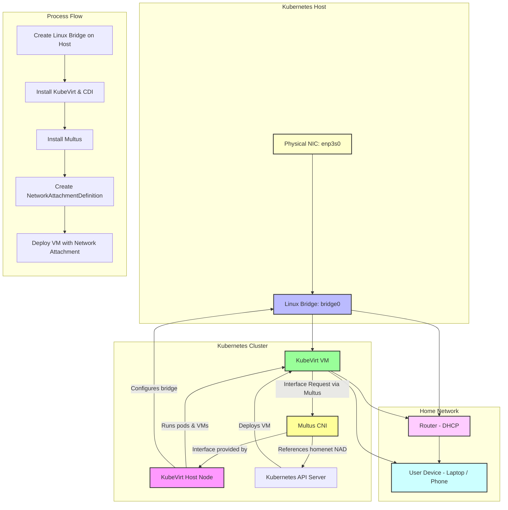

```mermaid
graph TD
    %% Home Network
    subgraph "Home Network"
        LAN_Router["Router - DHCP"]
        User_Device["User Device - Laptop / Phone"]
    end

    %% Kubernetes Host
    subgraph "Kubernetes Host"
        direction LR
        Host_NIC["Physical NIC: enp3s0"]
        Linux_Bridge["Linux Bridge: bridge0"]
    end

    %% Kubernetes Cluster
    subgraph "Kubernetes Cluster"
        Kube_Host["KubeVirt Host Node"]
        Kube_API["Kubernetes API Server"]
        Multus["Multus CNI"]
        KubeVirt_VM["KubeVirt VM"]
    end

    %% Styles
    style Kube_Host fill:#f9f,stroke:#333,stroke-width:2px
    style Linux_Bridge fill:#bbf,stroke:#333,stroke-width:2px
    style KubeVirt_VM fill:#9f9,stroke:#333,stroke-width:2px
    style Multus fill:#ff9,stroke:#333,stroke-width:2px
    style Host_NIC fill:#ffc,stroke:#333,stroke-width:2px
    style User_Device fill:#cff,stroke:#333,stroke-width:2px
    style LAN_Router fill:#fcf,stroke:#333,stroke-width:2px

    %% Connections: Host ↔ LAN
    Host_NIC --> Linux_Bridge
    Linux_Bridge --> KubeVirt_VM
    Linux_Bridge --> LAN_Router
    LAN_Router --> User_Device
    KubeVirt_VM --> User_Device
    KubeVirt_VM --> LAN_Router

    %% Connections: Kubernetes
    KubeVirt_VM -->|Interface Request via Multus| Multus
    Multus -->|Interface provided by| Kube_Host
    Multus -->|References homenet NAD| Kube_API
    Kube_API -->|Deploys VM| KubeVirt_VM
    Kube_Host -->|Runs pods & VMs| KubeVirt_VM
    Kube_Host -->|Configures bridge| Linux_Bridge

    %% Process Flow
    subgraph "Process Flow"
        direction TB
        A["Create Linux Bridge on Host"] --> B["Install KubeVirt & CDI"] --> C["Install Multus"] --> D["Create NetworkAttachmentDefinition"] --> E["Deploy VM with Network Attachment"]
    end

```